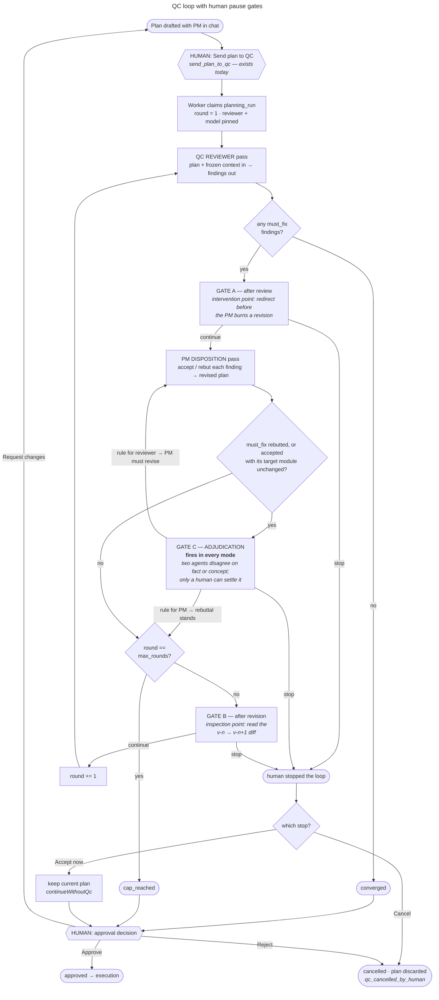
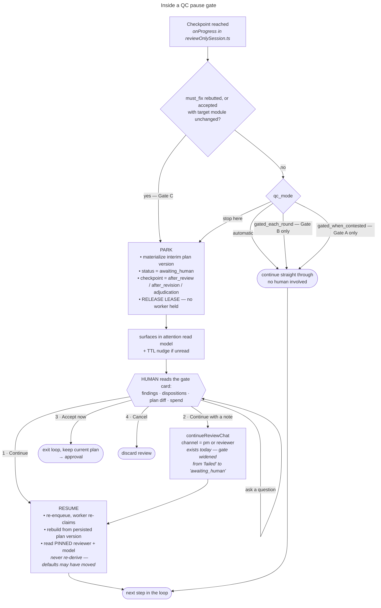

# QC Pause Points — Human Gates in the Plan Review Loop

Plan QC currently runs to completion once a human sends a plan to review. This
document specifies optional human gates between QC steps, the settings that
control them, and the surfaces that present them. It is a plan, not an
implementation record: nothing described here is built yet.

## Problem

`send_plan_to_qc` is the last human decision before a plan review terminates.
After it, `runReviewOnlyPlanning` (`apps/server/src/planning/reviewOnlySession.ts`)
drives reviewer and PM passes to convergence, round cap, or failure without
further human input. The QC transcript is rendered live, but as a ticker inside
the plan conversation — information that scrolls past rather than information
that asks anything of the operator.

The cost is concentrated at one point: when the reviewer files a finding the
human knows to be wrong, the PM spends a full revision pass answering it, and
the corrected plan carries the mistake into every later round. There is no
supported way to intervene between the reviewer's output and the PM's response.

## Design summary

Two optional gates per round, plus one mandatory gate, all at checkpoints the
loop already reaches:

- **Gate A — after the reviewer pass.** The intervention point. The human sees
  findings before the PM has responded to them. Optional.
- **Gate B — after the PM disposition pass.** The inspection point. The human
  sees dispositions and the resulting plan diff. Optional.
- **Gate C — unresolved must-fix objection.** The adjudication point. The PM
  either rebutted a must-fix finding, or accepted it without changing the plan
  region it targets. **Not optional** — see "Adjudication" below.

A gate parks the review durably, releases the worker lease, and waits. Resume
re-claims and continues from persisted state. Gating for A and B is a
per-project default, overridable at kickoff and editable mid-flight; Gate C
fires in every mode.

Inside any gate:

## Why the checkpoints already exist

`runReviewOnlyPlanning` calls `options.onProgress(rounds)` twice per round:
after the reviewer emits findings, and after the PM emits dispositions plus a
revised plan. Those two calls are Gate A and Gate B. The loop's shape does not
change; the checkpoints gain the ability to stop.

The convergence test runs between the reviewer pass and Gate A. A review with
zero must-fix findings terminates as `converged` without reaching a gate — there
is no decision to present, and stopping to confirm an empty finding list trains
operators to click without reading.

## Durability: a gate parks, it does not wait

A gate must not be implemented as an awaited promise inside `onProgress`.

Planning runs execute under a database lease (`apps/server/src/planning/runWorker.ts`,
default 10 minutes) with an `AbortController` for cancellation. A suspended
`await` inside the loop holds a worker slot for the duration of human latency,
expires its lease into a spurious failure, and does not survive a deploy.

Instead, a gate returns. The run:

1. materializes the current plan as a plan version,
2. sets review status to `awaiting_human` with its checkpoint and round,
3. releases the lease and clears the run's claim,
4. exits the worker.

Resume re-enqueues the run; the worker re-claims it and continues from the
persisted plan version at the next step.

This is cheap because of an existing property of the loop: every reviewer and PM
pass is an independent structured completion carrying the plan and the frozen
context receipt. There is no provider-side conversation state to preserve, so a
pause of ten seconds and a pause of ten days cost the same and lose nothing.

### Persistence gap

Round exchanges currently persist content *hashes* only —
`reviewed_plan_content_hash` and `pm.revised_plan_content_hash`
(`packages/contracts/src/v2/conversation.ts`, `V2ConversationPlanReviewRound`).
The plan body itself lives in the loop's local `plan` variable and is only
materialized at terminal via `revised_plan_version_id`. Resume requires the
round's plan body.

**Decision: materialize an interim `V2WorkPlanVersion` at each gate.** The
alternative — stashing plan JSON on the planning run row — is lighter but yields
no diff surface. Reading what changed between v(n) and v(n+1) is most of the
value of stopping at Gate B, and plan versions already provide that comparison.

**Decision: interim versions are retained, flagged, and de-emphasized.** They
are the round-by-round record of how a plan evolved under review, which is worth
keeping. But a three-round review would otherwise leave four machine-authored
versions sitting in the same list as the operator's own revisions. Requirements:

- an explicit `origin` marker distinguishing QC-interim versions from
  human-authored ones,
- version history collapses them by default behind a single expandable entry
  per review ("4 QC rounds"),
- they are never offered as the target of approval, execution, or diff-against
  by default; the review's result version is,
- they are addressable when explicitly requested, so a gate card can diff
  v(n) → v(n+1) directly.

## Adjudication: unresolved must-fix rebuttals

**A must-fix finding the PM rebuts — or accepts without changing the plan —
stops the review in every mode, including `automatic`.**

The rationale is empirical rather than theoretical. Reviewer/PM disagreement is
common, and it is usually *factual* — one side did not read the code, or read it
and misunderstood it. Both agents work from the same frozen context receipt with
no repository access and no transcript, so neither can resolve a factual dispute
by going and looking. Left alone, the loop proceeds with the disagreement
unsettled, and whichever agent spoke last effectively wins. The other case —
a genuine difference over concept or implementation approach — is not something
a further round resolves either; it is a decision.

Both cases are precisely the judgment a human is for, so this is a requirement,
not a cadence preference. `automatic` means "no cadence gates," not "no
correctness gates."

**The escape hatch is one flag with a narrow meaning.**
`allow_unadjudicated_rebuttals` (default false, documented as discouraged)
suppresses stops for *declared rebuttals only*. Hollow acceptance always stops
and cannot be switched off. Choosing not to referee open disagreements is a
legitimate operating preference; choosing not to detect a must-fix finding that
was accepted and then ignored is not the same decision, and one flag should not
silently make both. Keeping the flag's scope narrow is what keeps the two
concerns separate without introducing a second setting.

### Trigger definition

Gate C fires on either of two conditions against a `must_fix` finding.

**1. Declared rebuttal.** The PM's disposition is `rebut`. This is a self-report
already present in the contract, so it needs no structural comparison. It is the
honest disagreement case, and it is what the gate exists for.

**2. Hollow acceptance.** The PM's disposition is `accept`, but the plan region
the finding targets is unchanged. Without this condition, a PM that accepts a
finding in words and changes nothing passes silently, while a PM that disagrees
openly is stopped — exactly backwards. A must-fix that produced no change is
materially the same outcome as a rebuttal regardless of what it was called; the
adjudication card wording differs ("PM accepted but the plan is unchanged") but
the stop is the same.

**"Unchanged" is scoped to the finding's target, not the whole plan.** A
whole-plan content-hash comparison is defeated by any unrelated edit in the same
pass. Findings carry `module_id`; compare the canonical hash of that module's
subtree before and after the revision. For plan-level findings (`module_id`
null), fall back to whole-plan canonical comparison. Reuse `canonicalSha256`, so
ordering and whitespace normalization behave identically to existing plan
hashing.

**Findings batch into one stop.** A single PM pass can produce several
rebuttals; Gate C presents all qualifying findings in one gate card with a
ruling per finding, not one stop per finding.

**`should_fix` does not trigger Gate C on its own.** Severity is the reviewer's
own judgment about what blocks, and a mandatory stop that fires on every review
stops being read — the same failure mode as gating every step. Instead:

- rebutted `should_fix` findings are **aggregated on the approval card** ("3
  should-fix findings rebutted across 2 rounds", expandable), surfacing the
  pattern at the point a decision is already being made;
- a rebutted `should_fix` finding **escalates to Gate C** when a later round
  files another `should_fix` finding against the same `module_id`, using the
  same dumb match rule described below.

### Repeat disputes across attempts

**A prior ruling is never injected into a later reviewer's context.** A second
attempt is worth running only because the new reviewer reaches the plan
independently; telling it how the last dispute was settled buys consistency at
the cost of the independence that justified the attempt.

**The same dispute is adjudicated again, from scratch.** The second pass may
carry different or better information, and the human may rule differently.

**Recurrence is itself evidence, and is surfaced to the human.** That a finding
has been raised twice — by different reviewers, across attempts, or by the same
reviewer across rounds — is a signal about the plan, independent of either
ruling's merits. Requirements:

- the adjudication card shows prior occurrences of the finding and how each was
  ruled, including rulings from earlier attempts;
- repeat disputes rank above first-time disputes in the attention model;
- the approval card summarizes contested themes — findings raised more than once
  across the work item's reviews — so a persistently disputed area is visible at
  the decision point rather than buried in round transcripts.

**Matching stays dumb on purpose.** Recurrence is detected as *another must-fix
finding against the same `module_id`* — no semantic comparison, no similarity
scoring, no confidence threshold. Findings with a null `module_id` are not
matched at all.

The rule is imprecise in both directions and that is acceptable: the human is
already reading both findings side by side and can see in two sentences whether
it is the same objection. A false match costs a glance; a missed one costs
nothing that the finding itself does not already surface. Anything cleverer
would be machinery built to serve a problem that has not appeared in practice.

### The adjudication card

The disagreement is usually factual, so the card's job is to expose the facts
each side had, not merely to present two opinions:

1. The finding, verbatim, with its severity and the plan module it targets.
2. The PM's rebuttal and rationale, verbatim.
3. **The context manifest** — what was actually in the frozen receipt both
   agents read. When one side "didn't review the code," the manifest is where
   that shows up, and it converts an argument into a checkable question.
4. Whether this finding was also raised in an earlier round, and how it was
   dispositioned then. A repeat rebuttal is a different situation from a first
   one.

### Outcomes

Beyond the standard exits, adjudication adds a **ruling**:

- **Rule for the reviewer** — the finding stands. The PM gets a revision pass
  and must address it; it cannot be rebutted again. If the review is at its
  round cap, offer to raise the cap by one so the ruling can be carried out
  rather than expiring into `cap_reached`.
- **Rule for the PM** — the rebuttal stands. The finding is closed as
  human-dismissed and does not re-block later rounds.
- **Supply the missing fact** — the common resolution when one side lacked
  context. The human adds the fact and returns it to whichever agent needs it,
  which is the "continue with a note" path with an adjudication attached.

A ruling is a human-authored disposition and must be recorded as one rather than
attributed to an agent. Extend the disposition record with an adjudication block
(`decided_by_user_id`, `ruling`, `rationale`, `decided_at`); do not synthesize an
agent disposition on the human's behalf. Existing invariants require every
must-fix finding to carry an attributable disposition at terminal — a human
ruling satisfies that requirement and should be visibly distinct in the record.

## Contract changes

In `packages/contracts/src/v2/conversation.ts`:

1. **`V2ConversationPlanReviewStatus`** gains `awaiting_human`.
2. **`V2ConversationPlanReview`** gains `paused_checkpoint`
   (`after_review` | `after_revision` | `adjudication` | null),
   `paused_at_round`, and a settings-provenance record (below).
3. **`V2ConversationPlanReviewDisposition`** gains an optional adjudication
   block (`decided_by_user_id`, `ruling`, `rationale`, `decided_at`) for human
   rulings. A finding closed by ruling satisfies the must-fix disposition
   requirement at terminal and is distinguishable from an agent disposition.
4. **Timing invariant.** `awaiting_human` is non-terminal: `started_at` set,
   `completed_at` null. Add the branch to the `validTiming` check.
5. **Evidence-visibility invariant — the one that requires care.** The current
   rule forbids `queued | running | failed | cancelled` reviews from exposing
   findings, dispositions, or revision evidence. A paused review *must* expose
   findings; that is the point of pausing. `awaiting_human` therefore joins the
   evidence-visible set while remaining non-terminal. The must-fix disposition
   completeness rule stays terminal-only — a review parked at Gate A has
   findings with no dispositions yet, and that is correct.
6. **`revised_plan_version_id` coupling.** The rule tying a changed
   `result_plan_content_hash` to a materialized revision must accommodate
   interim versions at Gate B without implying terminal success.

`rounds_completed` and the `round_exchanges.length <= rounds_completed + 1`
bound are unaffected: parking does not complete a round.

## Resume correctness

**Pinned reviewer identity must be read, never re-derived.** The transcript
invariant requires every round's reviewer to match the review's pinned
`reviewer_provider` / `reviewer_model`. If a resume path re-resolves the
reviewer from project settings, a project whose default model changed while the
review was parked will fail validation on the next round — at the worst possible
moment, after human input. Resume reads the pinned values off the review row.

Related consequences:

- Resume is idempotent under an `idempotency_key`, consistent with other
  conversation actions.
- Cancel while parked already works (`cancelReview`); confirm `cancelReviewNow`
  no-ops when no in-process controller exists for the run.
- A parked review holds no lease, so lease-expiry recovery must not treat
  `awaiting_human` runs as abandoned.

## Gate exits

Four, not two. The single "stop" of the original sketch conflates two opposite
intentions, and the codebase already distinguishes them.

| Exit | Behavior | Existing mechanism |
| --- | --- | --- |
| **Continue** | Advance one step | new |
| **Continue with a note** | Send an instruction to the reviewer or PM, then advance | `continueReviewChat` |
| **Accept now** | Exit the loop, keep the current plan, go to approval | `continueWithoutQc` |
| **Cancel** | Discard the review | `cancelReview` (`qc_cancelled_by_human`) |

At round 2 of 3, "stop" almost always means *accept now*. Today it would mean
*cancel*. Keeping these separate is the highest-value detail of the gate UI.

Two compound exits materially improve the ergonomics:

- **Continue, and stop asking** — sets `qc_mode = automatic` for this run and
  continues.
- **Hold at the next checkpoint** — available on a *running* review, not just a
  parked one. Costs nothing to implement because checkpoints re-read the mode
  each time they are reached.

Without these, gating is a mode chosen in advance and regretted in one direction
or the other.

## Human chat at a gate

`continueReviewChat` already accepts a channel (`reviewer` | `pm`), issues a
real model call, and records the exchange as chat messages and markdown
artifacts. It is currently gated to `status === 'failed'`. Widening that gate to
`awaiting_human` supplies most of this capability.

Three distinct interactions, which must not collapse into one control:

1. **Question** — "why is finding 3 a must-fix?" Answered in place. **Does not
   advance the run.** The review stays parked; only Continue advances. If asking
   a question resumes the loop, operators stop asking questions.
2. **Redirect the reviewer** — folded into the next reviewer pass.
3. **Coach the PM** — at Gate A, shapes the revision before it is produced. This
   is where Gate A earns its cost.

### Provenance requirement

Review independence rests on the reviewer receiving a frozen, transcript-free
context receipt (`reviewOnlySystem`). Human messages into a live review are a
deliberate exception to that isolation, and the record must say so.

- Chat messages already carry `speaker: human`; use it.
- The review records whether it was human-steered, at which rounds.
- The approval card states it: *"This review was human-steered at round 2"*,
  notes expandable.

A review that converged because a human told the reviewer to drop an objection
must not read, months later, as one that converged on the merits.

## Settings: three layers

Stored alongside existing QC settings in `planning_reviewer_settings`
(`reviewer_provider`, `reviewer_model`, `default_max_rounds`), edited through
`PATCH /api/v2/projects/:id/settings`.

**`qc_mode`** values:

| Value | Gate A | Gate B | Gate C |
| --- | --- | --- | --- |
| `automatic` | — | — | **stop** |
| `gated_each_round` | — | stop | **stop** |
| `gated_each_step` | stop | stop | **stop** |
| `gated_when_contested` | stop | — | **stop** |

Gate C is not a column the mode controls; it is shown to make explicit that no
mode skips it. The only way to soften it is the project-level
`allow_unadjudicated_rebuttals` escape hatch (default false), which suppresses
declared-rebuttal stops only — hollow-acceptance stops always fire.

`gated_when_contested` is the recommended working default once gating is
adopted: it stops only where intervention is cheapest and skips inspection-only
stops. The project default ships as `automatic` so no in-flight or existing
behavior changes — but note that adopting these gates means even `automatic`
reviews can now stop, at Gate C. That is intended, and it is the one behavior
change existing projects will notice.

**Where it is set:**

1. **Project setup** — the default for new work. Changing it does not reach into
   runs already in flight; those pinned their mode at kickoff.
2. **Kickoff** — a control on the send-to-QC action, pre-filled from the project
   default and pinned onto the review row. Most decisions will be made here.
3. **Mid-flight** — editable from the QC tab and from the gate card itself.

Precedence: project → work item → in-run. Surfaces show the effective value and
its source ("project default" vs "set for this work item" vs "changed at round 2
by <user>").

### Mutability mid-flight

**Cadence is mutable; identity is not.**

| Setting | Mid-flight | Rationale |
| --- | --- | --- |
| `qc_mode` | Freely | Checkpoints re-read it; cannot invalidate completed work |
| `max_rounds` | Raise freely; lower only to `> rounds_completed` | Raising beats accepting a cap. Lowering below completed rounds violates `rounds_completed <= max_rounds`. Use *Accept now* to stop early. |
| Reviewer provider / model | **No — new attempt** | Every round must match the pinned reviewer. Mutating mid-run either fails validation or produces a transcript half-reviewed by each model. |

The attempt mechanism (`attempt_number`) already expresses "review this again
with a different reviewer" cleanly.

## Surfaces

### Work tab: three sub-tabs

QC is currently a collapsible section inside the plan conversation
(`apps/web/src/ConversationWorkspace.tsx`, `conversation-qc-activity`). A review
is a substantial artifact — up to five rounds, findings and dispositions per
round, two transcript channels, plan versions, and multiple attempts against one
plan version. It needs a place, not a drawer.

- **Plan** — the PM conversation.
- **QC** — attempts, rounds, findings, gate cards. Hidden when the project runs
  no QC at all.
- **Implementation** — execution.

Tab visibility keys on *whether QC runs*, not on whether it gates. Three states:
QC off (two tabs), QC automatic (three tabs, QC as record), QC gated (three
tabs, QC actionable).

**Tabs hide state, which is the failure mode gating introduces.** Mitigations,
both required:

- A "needs you" badge on the QC tab.
- A persistent one-line QC status strip on the Plan tab: *"QC round 2 of 3 ·
  paused, waiting on you →"*.

Additionally, a "discuss in Plan" action on any finding carries it into the PM
conversation as a quote, so reading a review and acting on it are not separated
by retyping.

### Gate card

1. Header: round position, checkpoint, severity counts, cumulative spend.
2. Findings, must-fix first: the objection, its recommendation, the plan module
   it lands on.
3. At Gate B: each finding paired with its disposition, plus the v(n) → v(n+1)
   plan diff. The diff is not redundant with the dispositions — "accepted, will
   add error handling" and the plan actually gaining error handling are
   different facts, and only the diff distinguishes them.
4. Four exits, plus a note field and a question field.

At Gate C the card is the adjudication card described above: the disputed
finding, the rebuttal, the context manifest both agents read, and the ruling
controls in place of a plain Continue.

Per-round markdown artifacts are already written, so export of a gate card is
close to free.

### Attention

A parked review is indistinguishable from a running one without explicit
signaling, and an unattended park stalls the work item indefinitely. Wire
`awaiting_human` into the attention read models
(`apps/server/src/.../phase5Attention`) and add a TTL nudge. This is not polish;
gating without it introduces a silent-stall failure mode.

**A question at a gate resets the TTL.** Asking the reviewer why it filed a
finding is engagement, not avoidance; nudging someone who is actively
deliberating is the fastest way to make the nudge worthless. Only elapsed time
with no interaction of any kind escalates.

**Gate C outranks Gate A and B in the attention model.** An optional cadence
stop is a convenience; an unadjudicated disagreement is blocked work with two
agents that cannot resolve it. Rank and label them differently.

## Build order

**Phase 1 — the mechanism.** `awaiting_human` status and contract changes; Gates
B and C; interim plan version materialization with the `origin` marker and
collapsed version history; park/resume through the worker; gate card with
Continue / Accept now / Cancel; attention wiring and TTL.

Gate C ships here because it is a requirement rather than a preference, but its
*ruling* outcomes depend on Phase 2's steering machinery. Interim behavior: Gate
C stops and presents the disagreement with the standard three exits, so a human
can read it and choose to proceed, accept the plan as-is, or cancel — they just
cannot yet record a binding ruling. State this limitation in the card rather
than letting it look like a ruling was recorded.

**Phase 2 — steering and rulings.** Gate A; widen `continueReviewChat` to
`awaiting_human`; question / redirect / coach as distinct interactions; the
adjudication block on dispositions with rule-for-reviewer / rule-for-PM /
supply-the-missing-fact; cap-raise-by-one when a ruling needs a revision pass it
does not have rounds for; human-steering provenance on the review and approval
card; same-module recurrence matching, prior-ruling history on the adjudication
card, `should_fix` recurrence escalation, and the contested-themes summary at
approval.

**Phase 3 — control and surfaces.** `qc_mode` across the three layers; compound
exits (*continue and stop asking*, *hold at next checkpoint*); mid-flight
mutability rules; three-tab Work layout with badge and status strip.

Phases 1 and 3 are independently shippable: Phase 3's tab work carries value
with QC still automatic, and Phase 1 is usable with gating enabled per run
before the full settings surface exists.

## Resolved

Six questions have been raised and decided across drafts; all are specified in
the body above.

1. **Interim plan versions are retained**, with an `origin` marker, collapsed by
   default in version history, and never offered as a default target for
   approval, execution, or diff.
2. **A question at a gate resets the TTL nudge.**
3. **An unresolved must-fix objection is a mandatory stop in every mode** — Gate
   C — because reviewer/PM disagreement is usually factual (one side did not
   read or did not understand the code) and neither agent can resolve it from a
   frozen context receipt. Where the dispute is instead conceptual, it is a
   decision rather than a review finding. Both need a human adjudicator.
4. **Prior rulings are never injected into a later reviewer's context.** The
   dispute is adjudicated again from scratch, possibly on better information and
   possibly to a different outcome. Independence is what makes a second attempt
   worth running.
5. **The Gate C trigger is a declared rebuttal or a hollow acceptance**, with
   "unchanged" scoped to the finding's target module rather than the whole plan.
   Self-reported disagreement and silent non-compliance are the same outcome and
   must be treated the same; scoping defeats cosmetic-edit evasion.
6. **`should_fix` does not trigger Gate C on its own** — it aggregates on the
   approval card — **but escalates to Gate C on recurrence.** A mandatory stop
   keeps its meaning only by being rare, while a repeated objection is evidence
   regardless of the severity label attached to it.
7. **Recurrence matching is same-module only.** No semantic comparison or
   confidence scoring: hundreds of QC rounds in practice have not produced the
   ambiguity that machinery would solve, and the human reading both findings
   resolves it faster than a matcher could.
8. **`allow_unadjudicated_rebuttals` suppresses declared-rebuttal stops only.**
   Hollow-acceptance stops always fire. One flag, narrow scope — the two
   concerns stay separate without a second setting.

Points 4 and 6 share a principle worth stating plainly, because it should govern
cases not yet enumerated: **recurrence is evidence, and it belongs to the human,
not to the agents.** Repetition is never resolved by telling an agent what was
decided last time; it is resolved by showing the human that the question keeps
coming back.

## Open questions

None blocking. Two things to watch once this is running, neither worth building
for in advance:

- **Hollow-acceptance false positives.** A must-fix finding whose correct remedy
  genuinely requires no plan change ("confirm X is out of scope") will stop the
  review. One click is a fair price for catching silent non-compliance. If it
  turns out to be common, add a "no plan change required" disposition variant
  then — not now.
- **Recurrence noise.** Same-module matching may group objections that are not
  really the same. The card shows both findings, so the human resolves it by
  reading. Revisit only if the signal proves useless in practice.
