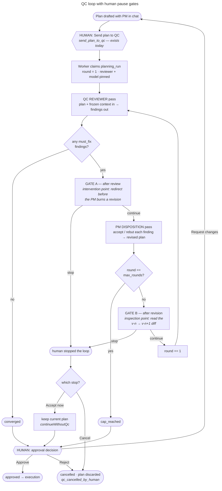
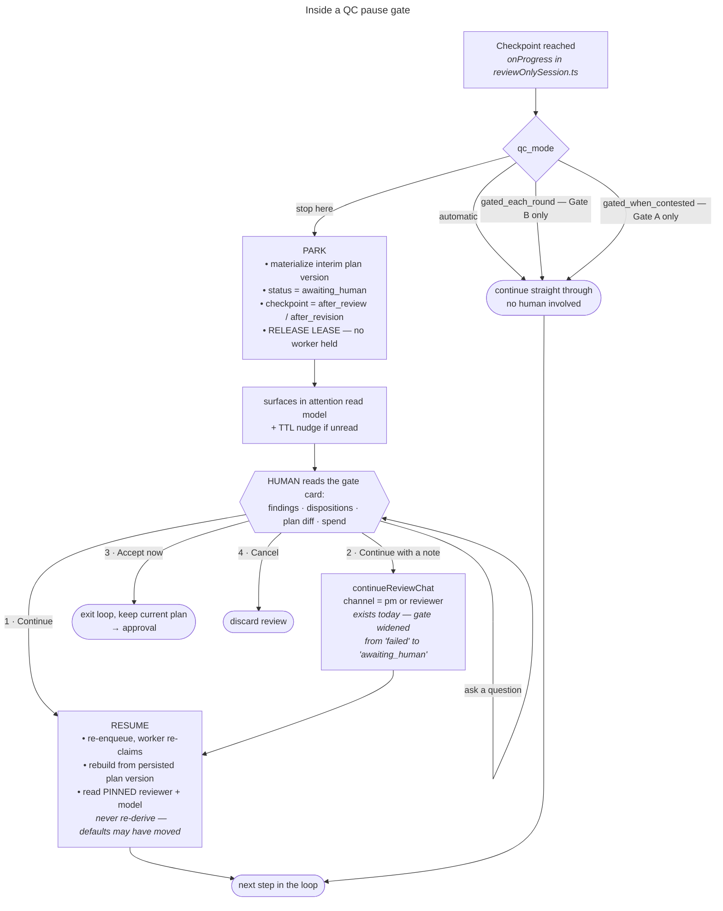

# QC Pause Points — Human Gates in the Plan Review Loop

Plan QC currently runs to completion once a human sends a plan to review. This
document specifies optional human gates between QC steps, the settings that
control them, and the surfaces that present them. It is a plan, not an
implementation record: nothing described here is built yet.

## Problem

`send_plan_to_qc` is the last human decision before a plan review terminates.
After it, `runReviewOnlyPlanning` (`apps/server/src/planning/reviewOnlySession.ts`)
drives reviewer and PM passes to convergence, round cap, or failure without
further human input. The QC transcript is rendered live, but as a ticker inside
the plan conversation — information that scrolls past rather than information
that asks anything of the operator.

The cost is concentrated at one point: when the reviewer files a finding the
human knows to be wrong, the PM spends a full revision pass answering it, and
the corrected plan carries the mistake into every later round. There is no
supported way to intervene between the reviewer's output and the PM's response.

## Design summary

Two optional gates per round, both at checkpoints the loop already reaches:

- **Gate A — after the reviewer pass.** The intervention point. The human sees
  findings before the PM has responded to them.
- **Gate B — after the PM disposition pass.** The inspection point. The human
  sees dispositions and the resulting plan diff.

A gate parks the review durably, releases the worker lease, and waits. Resume
re-claims and continues from persisted state. Gating is a per-project default,
overridable at kickoff and editable mid-flight.

Inside either gate:

## Why the checkpoints already exist

`runReviewOnlyPlanning` calls `options.onProgress(rounds)` twice per round:
after the reviewer emits findings, and after the PM emits dispositions plus a
revised plan. Those two calls are Gate A and Gate B. The loop's shape does not
change; the checkpoints gain the ability to stop.

The convergence test runs between the reviewer pass and Gate A. A review with
zero must-fix findings terminates as `converged` without reaching a gate — there
is no decision to present, and stopping to confirm an empty finding list trains
operators to click without reading.

## Durability: a gate parks, it does not wait

A gate must not be implemented as an awaited promise inside `onProgress`.

Planning runs execute under a database lease (`apps/server/src/planning/runWorker.ts`,
default 10 minutes) with an `AbortController` for cancellation. A suspended
`await` inside the loop holds a worker slot for the duration of human latency,
expires its lease into a spurious failure, and does not survive a deploy.

Instead, a gate returns. The run:

1. materializes the current plan as a plan version,
2. sets review status to `awaiting_human` with its checkpoint and round,
3. releases the lease and clears the run's claim,
4. exits the worker.

Resume re-enqueues the run; the worker re-claims it and continues from the
persisted plan version at the next step.

This is cheap because of an existing property of the loop: every reviewer and PM
pass is an independent structured completion carrying the plan and the frozen
context receipt. There is no provider-side conversation state to preserve, so a
pause of ten seconds and a pause of ten days cost the same and lose nothing.

### Persistence gap

Round exchanges currently persist content *hashes* only —
`reviewed_plan_content_hash` and `pm.revised_plan_content_hash`
(`packages/contracts/src/v2/conversation.ts`, `V2ConversationPlanReviewRound`).
The plan body itself lives in the loop's local `plan` variable and is only
materialized at terminal via `revised_plan_version_id`. Resume requires the
round's plan body.

**Decision: materialize an interim `V2WorkPlanVersion` at each gate.** The
alternative — stashing plan JSON on the planning run row — is lighter but yields
no diff surface. Reading what changed between v(n) and v(n+1) is most of the
value of stopping at Gate B, and plan versions already provide that comparison.
Interim versions must be marked as QC-interim so they do not present as
human-authored plan revisions in version history.

## Contract changes

In `packages/contracts/src/v2/conversation.ts`:

1. **`V2ConversationPlanReviewStatus`** gains `awaiting_human`.
2. **`V2ConversationPlanReview`** gains `paused_checkpoint`
   (`after_review` | `after_revision` | null), `paused_at_round`, and a
   settings-provenance record (below).
3. **Timing invariant.** `awaiting_human` is non-terminal: `started_at` set,
   `completed_at` null. Add the branch to the `validTiming` check.
4. **Evidence-visibility invariant — the one that requires care.** The current
   rule forbids `queued | running | failed | cancelled` reviews from exposing
   findings, dispositions, or revision evidence. A paused review *must* expose
   findings; that is the point of pausing. `awaiting_human` therefore joins the
   evidence-visible set while remaining non-terminal. The must-fix disposition
   completeness rule stays terminal-only — a review parked at Gate A has
   findings with no dispositions yet, and that is correct.
5. **`revised_plan_version_id` coupling.** The rule tying a changed
   `result_plan_content_hash` to a materialized revision must accommodate
   interim versions at Gate B without implying terminal success.

`rounds_completed` and the `round_exchanges.length <= rounds_completed + 1`
bound are unaffected: parking does not complete a round.

## Resume correctness

**Pinned reviewer identity must be read, never re-derived.** The transcript
invariant requires every round's reviewer to match the review's pinned
`reviewer_provider` / `reviewer_model`. If a resume path re-resolves the
reviewer from project settings, a project whose default model changed while the
review was parked will fail validation on the next round — at the worst possible
moment, after human input. Resume reads the pinned values off the review row.

Related consequences:

- Resume is idempotent under an `idempotency_key`, consistent with other
  conversation actions.
- Cancel while parked already works (`cancelReview`); confirm `cancelReviewNow`
  no-ops when no in-process controller exists for the run.
- A parked review holds no lease, so lease-expiry recovery must not treat
  `awaiting_human` runs as abandoned.

## Gate exits

Four, not two. The single "stop" of the original sketch conflates two opposite
intentions, and the codebase already distinguishes them.

| Exit | Behavior | Existing mechanism |
| --- | --- | --- |
| **Continue** | Advance one step | new |
| **Continue with a note** | Send an instruction to the reviewer or PM, then advance | `continueReviewChat` |
| **Accept now** | Exit the loop, keep the current plan, go to approval | `continueWithoutQc` |
| **Cancel** | Discard the review | `cancelReview` (`qc_cancelled_by_human`) |

At round 2 of 3, "stop" almost always means *accept now*. Today it would mean
*cancel*. Keeping these separate is the highest-value detail of the gate UI.

Two compound exits materially improve the ergonomics:

- **Continue, and stop asking** — sets `qc_mode = automatic` for this run and
  continues.
- **Hold at the next checkpoint** — available on a *running* review, not just a
  parked one. Costs nothing to implement because checkpoints re-read the mode
  each time they are reached.

Without these, gating is a mode chosen in advance and regretted in one direction
or the other.

## Human chat at a gate

`continueReviewChat` already accepts a channel (`reviewer` | `pm`), issues a
real model call, and records the exchange as chat messages and markdown
artifacts. It is currently gated to `status === 'failed'`. Widening that gate to
`awaiting_human` supplies most of this capability.

Three distinct interactions, which must not collapse into one control:

1. **Question** — "why is finding 3 a must-fix?" Answered in place. **Does not
   advance the run.** The review stays parked; only Continue advances. If asking
   a question resumes the loop, operators stop asking questions.
2. **Redirect the reviewer** — folded into the next reviewer pass.
3. **Coach the PM** — at Gate A, shapes the revision before it is produced. This
   is where Gate A earns its cost.

### Provenance requirement

Review independence rests on the reviewer receiving a frozen, transcript-free
context receipt (`reviewOnlySystem`). Human messages into a live review are a
deliberate exception to that isolation, and the record must say so.

- Chat messages already carry `speaker: human`; use it.
- The review records whether it was human-steered, at which rounds.
- The approval card states it: *"This review was human-steered at round 2"*,
  notes expandable.

A review that converged because a human told the reviewer to drop an objection
must not read, months later, as one that converged on the merits.

## Settings: three layers

Stored alongside existing QC settings in `planning_reviewer_settings`
(`reviewer_provider`, `reviewer_model`, `default_max_rounds`), edited through
`PATCH /api/v2/projects/:id/settings`.

**`qc_mode`** values:

| Value | Gate A | Gate B |
| --- | --- | --- |
| `automatic` | — | — |
| `gated_each_round` | — | stop |
| `gated_each_step` | stop | stop |
| `gated_when_contested` | stop | — |

`gated_when_contested` is the recommended working default once gating is
adopted: it stops only where intervention is cheapest and skips inspection-only
stops. The project default ships as `automatic` so no in-flight or existing
behavior changes.

**Where it is set:**

1. **Project setup** — the default for new work. Changing it does not reach into
   runs already in flight; those pinned their mode at kickoff.
2. **Kickoff** — a control on the send-to-QC action, pre-filled from the project
   default and pinned onto the review row. Most decisions will be made here.
3. **Mid-flight** — editable from the QC tab and from the gate card itself.

Precedence: project → work item → in-run. Surfaces show the effective value and
its source ("project default" vs "set for this work item" vs "changed at round 2
by <user>").

### Mutability mid-flight

**Cadence is mutable; identity is not.**

| Setting | Mid-flight | Rationale |
| --- | --- | --- |
| `qc_mode` | Freely | Checkpoints re-read it; cannot invalidate completed work |
| `max_rounds` | Raise freely; lower only to `> rounds_completed` | Raising beats accepting a cap. Lowering below completed rounds violates `rounds_completed <= max_rounds`. Use *Accept now* to stop early. |
| Reviewer provider / model | **No — new attempt** | Every round must match the pinned reviewer. Mutating mid-run either fails validation or produces a transcript half-reviewed by each model. |

The attempt mechanism (`attempt_number`) already expresses "review this again
with a different reviewer" cleanly.

## Surfaces

### Work tab: three sub-tabs

QC is currently a collapsible section inside the plan conversation
(`apps/web/src/ConversationWorkspace.tsx`, `conversation-qc-activity`). A review
is a substantial artifact — up to five rounds, findings and dispositions per
round, two transcript channels, plan versions, and multiple attempts against one
plan version. It needs a place, not a drawer.

- **Plan** — the PM conversation.
- **QC** — attempts, rounds, findings, gate cards. Hidden when the project runs
  no QC at all.
- **Implementation** — execution.

Tab visibility keys on *whether QC runs*, not on whether it gates. Three states:
QC off (two tabs), QC automatic (three tabs, QC as record), QC gated (three
tabs, QC actionable).

**Tabs hide state, which is the failure mode gating introduces.** Mitigations,
both required:

- A "needs you" badge on the QC tab.
- A persistent one-line QC status strip on the Plan tab: *"QC round 2 of 3 ·
  paused, waiting on you →"*.

Additionally, a "discuss in Plan" action on any finding carries it into the PM
conversation as a quote, so reading a review and acting on it are not separated
by retyping.

### Gate card

1. Header: round position, checkpoint, severity counts, cumulative spend.
2. Findings, must-fix first: the objection, its recommendation, the plan module
   it lands on.
3. At Gate B: each finding paired with its disposition, plus the v(n) → v(n+1)
   plan diff. The diff is not redundant with the dispositions — "accepted, will
   add error handling" and the plan actually gaining error handling are
   different facts, and only the diff distinguishes them.
4. Four exits, plus a note field and a question field.

Per-round markdown artifacts are already written, so export of a gate card is
close to free.

### Attention

A parked review is indistinguishable from a running one without explicit
signaling, and an unattended park stalls the work item indefinitely. Wire
`awaiting_human` into the attention read models
(`apps/server/src/.../phase5Attention`) and add a TTL nudge. This is not polish;
gating without it introduces a silent-stall failure mode.

## Build order

**Phase 1 — the mechanism.** `awaiting_human` status and contract changes; Gate
B only; interim plan version materialization; park/resume through the worker;
gate card with Continue / Accept now / Cancel; attention wiring and TTL. Smallest
contract surface that delivers the core behavior.

**Phase 2 — steering.** Gate A; widen `continueReviewChat` to `awaiting_human`;
question / redirect / coach as distinct interactions; human-steering provenance
on the review and approval card.

**Phase 3 — control and surfaces.** `qc_mode` across the three layers; compound
exits (*continue and stop asking*, *hold at next checkpoint*); mid-flight
mutability rules; three-tab Work layout with badge and status strip.

Phases 1 and 3 are independently shippable: Phase 3's tab work carries value
with QC still automatic, and Phase 1 is usable with gating enabled per run
before the full settings surface exists.

## Open questions

- Should interim plan versions be garbage-collected when a review terminates, or
  retained as the round-by-round record? Retention is more useful and costs
  version-history noise.
- Does a question at a gate reset the TTL nudge? Probably yes — engagement
  without a decision is still engagement.
- Should `gated_when_contested` also stop at Gate B when the PM *rebuts* rather
  than accepts a must-fix finding? A rebuttal is the case where the plan does not
  change and the disagreement stands, which is arguably worth a human look.
